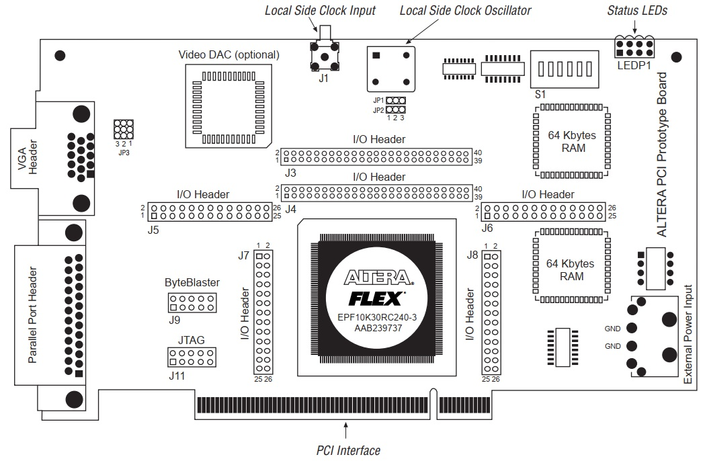
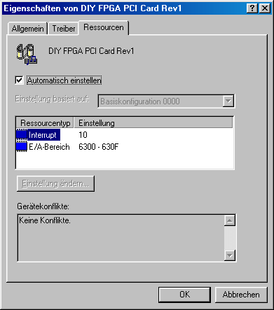
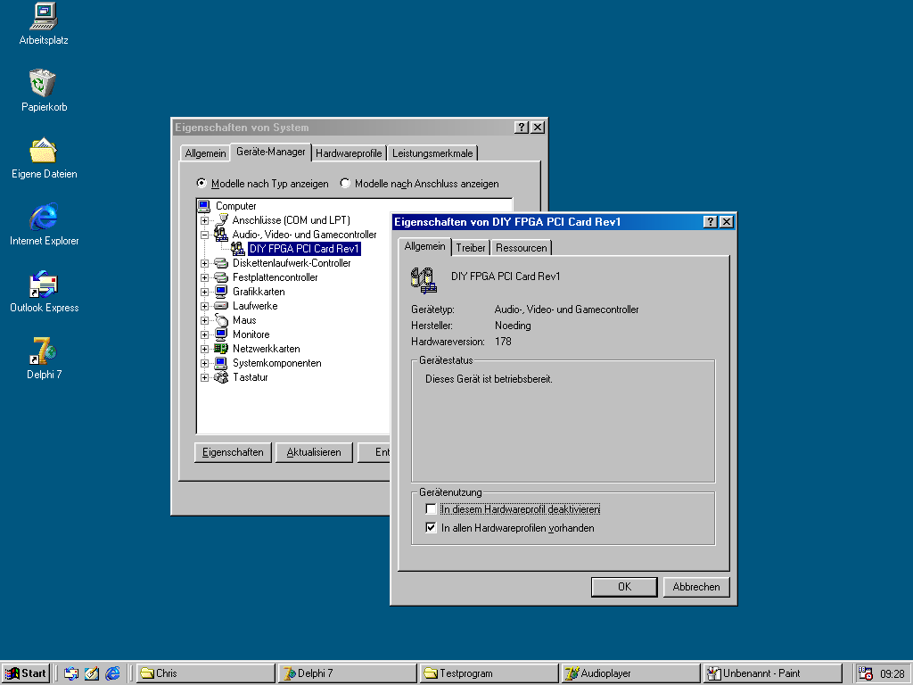
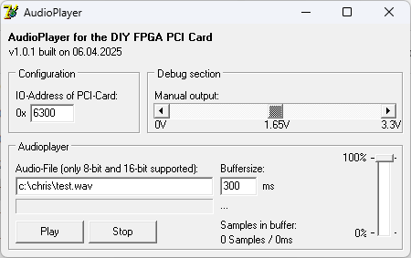
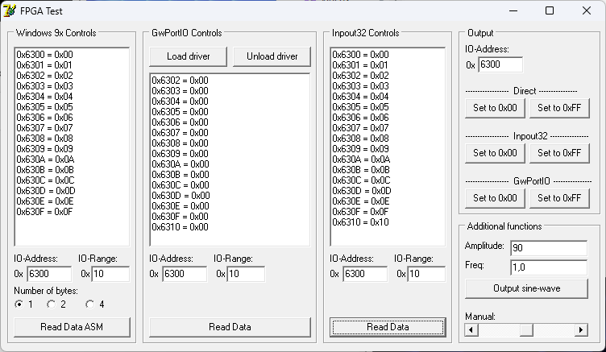
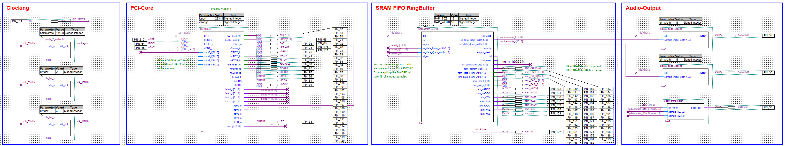
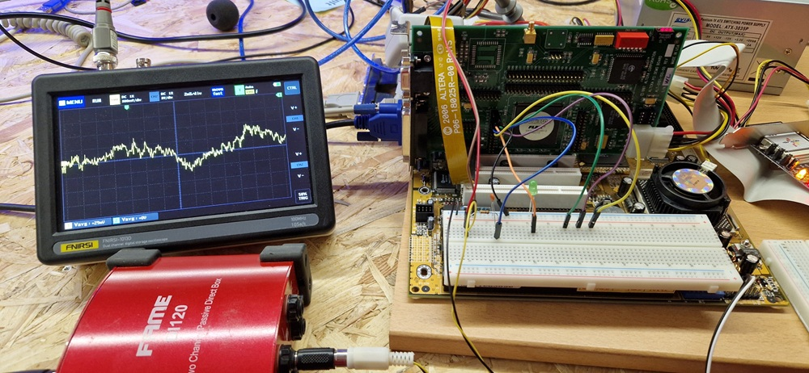
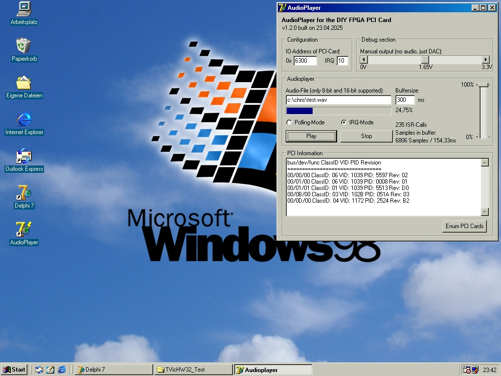

# FPGA_PCI_Card
FPGA PCI Card for (Retro-)Computers using Altera FLEX10K FPGAs

## General information

This repository contains the first steps of creating a DIY-PCI Card using a retro FPGA: the Altera FLEX10K EPF10K50RC240-3 and EPF10K30RC240-3. I've found an old Eval-Card on eBay with three of these FPGAs and I started thinking of what I can do with it. The general idea is, to create a DIY-PCI-Card with multiple functions and drivers for DOS, Win3.11 and/or Win9x.

As I have two development-boards, I switched to the smaller one with EPF10K30RC240-3 for now as this has a documentation, while the larger board has nothing more than the PCB itself.

## ToDos and plans for this project

Here is the progress I've already made with this card and project:
- [x] General reverse engineering of the Altera ARC-PCI Rev. 1.1 card from 1998/1999
- [x] Reverse engineering of the Altera ALT-0101-100-00 Dev-Board from 1997
- [x] Download of Altera Quartus 9.0 to synthesize logic for the Altera FLEX10K EPF10K50RC240-3 and EPF10K30RC240-3
- [x] Working toolchain using Altera USB Blaster connected to the JTAG-connector and uploading test-logic
- [x] First design of a PCI-target in VHDL with ioread, iowrite and confread to support Plug&Play-functions
- [x] Testing the onboard-PLL with 33 MHz clock
- [x] Testing PCI-card in computer (I built up a Intel Pentium MMX 233 MHz system for this project)
- [x] Writing Windows95 application and communicating with the card
- [X] Implementing memory-read/write using on-board SRAM
- [x] Implementing Audio-Output (Analog via Sigma-Delta-Modulation/PDM and Digital via SPDIF)
- [x] Working PCI-communication on Windows98 using TVicHW32-driver
- [x] Sending data to card under DOS using Borland C++ and inline-assembly
- [ ] Implementing some other cool functions
- [ ] Test if the card can be controlled from Win3.11 and/or OS/2 as well

## Current state

My implementation of the configuration-space as well as the IO-space is working fine. The card is detected by the BIOS and the requested IO-range is assigned. Memory-space is prepared, but not yet tested:

Audio-data can be written to the two onboard SRAM-ICs and a Windows98-software to communicate via Interrupts is already working.

## Driver and Software

Back in the days of Windows 3.11 and Win9x a driver was not signed and an inf-File could be written with a plain text-editor. As the card enumerates as a "Multimedia-Device", I've written a very short inf-File so that Windows puts the card into the Multimedia-Area in the device-manager:

The card-properties show up the specific IO- and memory-ranges:

For first tests I've implemented a short Win9x-application, that sends two 16-bit stereo-audio-samples using plain assembler to the card:

Another software reads the IO-space of the card:

At the moment the Quartus-project contains the PCI-functions, a FIFO RingBuffer for the audiodata and the audio-output:

## Outlook

At the moment I'm learning the basics of hardware development for computers using this project. So I will try different things without a very specific goal. Let's see, what will happen with this project :)

A newer version of the audioplayer is able to enumerate the PCI-cards and can send data using the interrupt of the card:

